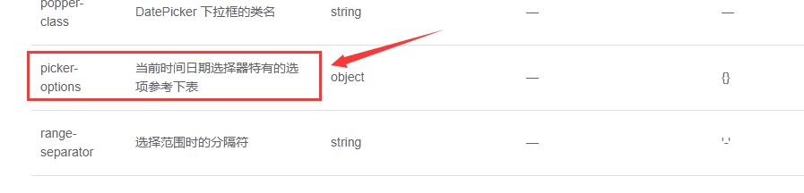

# 字段配置

## crudOptions.columns
在crudOptions中，最重要的是columns的配置
```js
const crudOptions ={
    columns:{
        key:{                              //字段的key
            title:'字段名',                 //字段名称
            type:'dict-select',            //字段类型
            dict: dict({url:'/dict/get'}), //字典配置（如果组件需要）
            form:{ component:{} },         //表单字段公共配置
            addForm:{ component:{} },      //添加表单字段独立配置，会与上面的form配置合并
            viewForm:{ component:{} },     //查看表单字段独立配置，会与上面的form配置合并
            editForm:{ component:{} },     //编辑表单字段独立配置，会与上面的form配置合并
            search:{ component:{} },       //查询表单字段独立配置，会与上面的form配置合并
            column:{ component:{} }        //列配置
        }
    }
}
```
## 字段组件配置
字段组件分为两种：
* 一种展示组件，出现在表格单元格中。
* 另外一种是form输入组件，出现在查询框、添加表单、修改表单、查看表单中。

对应到具体的配置中：
 1. column.form.component = 表单组件配置
 2. column.column.component = 表格行展示组件配置
 3. column.search.component = 查询表单组件配置
 4. column.viewForm.component = 查看表单组件独立配置
 5. column.addForm.component = 添加表单组件独立配置
 6. column.editForm.component = 编辑表单组件配置

::: warning
使用相关组件前，需要通过`app.use` 、 `app.component`全局引入组件    
或者在页面中配置`components`局部注册组件
:::
## 组件配置项
以`fs-dcit-select`为例 
```js
component:{ //组件配置
  name: 'fs-dict-select', //表单组件名称，支持任何v-model组件
  
  //v-model绑定，element一般为'modelValue'（可以不传）
  //antdv一般为'value'，必须要传
  vModel: '', 

  disabled: false, //组件是否禁用
  readonly: false, //组件是否是只读
  show: true, //是否显示该组件
  on:{ //组件事件监听
    onClick(context){console.log(context)} //监听表单组件的select事件
  },
  children:{ //组件的插槽(jsx)
     default:(scope)=>{  //默认插槽
        return (<div>{scope.data}</div>)
     },
     slotName:(scope)=>{  //具名插槽
        return (<div>{scope.data}</div>)
     }
  },

  // html属性,会直接传递给dom
  style:{width:'100px'},
  class:{'mr-5':true},

  //还可以在此处配置组件的参数，具体参数请查看对应的组件文档，不同组件参数不同
  separator:",",        //这是fs-dict-select的参数

  //fs-dict-select内部封装了el-select组件，所以此处还可以配置el-select的参数
  //如果ui用的是antdv，则支持a-select的参数
  filterable: true,     //可过滤选择项,
  multiple: true,       //支持多选
  clearable: true,      //可清除
}
```

## 我想要配置组件的某个功能该如何查找文档
下面以`日期选择器禁用今天之前的日期`这个需求为例
### 1. 查看type对应使用的什么组件
日期选择器我们配置的 `type=date`    
所以先去[字段类型列表](../../api/types)，查找`type=date`里面用的是什么组件   
在[日期时间选择](../../api/types#日期时间选择)这一条中我们找到了`type=date`的配置
```js
const types ={
    date: { // <----字段类型名
        form: { component: { name: 'el-date-picker' } },
        column: { component: { name: 'date-format', format: 'YYYY-MM-DD' } }
    }
}
```
从这里知道`type=date`使用的`el-date-picker`组件

### 2.查找该组件的文档，确定参数
在[日期时间选择](../../api/types#日期时间选择) 拉到下方   
可以看到相关组件的文档链接（如果没有文档链接，请告诉我，我会尽快加上的）
 
  

点击[el-date-picker](https://element-plus.gitee.io/#/zh-CN/component/date-picker)
跳转到elementUI的文档页面，找到禁用日期相关参数




### 3.给component添加参数
```js
export default ({expose}) => {
    return {
        crudOptions:{
            columns: {
                createDate:{
                    title: '日期',
                    type:'date',
                    form:{
                        component:{
                            disabledDate: time => {  // <----禁用日期的配置
                                return time.getTime() < Date.now()
                            }
                        }
                    }
                }
            }
        }
    }
}
```
