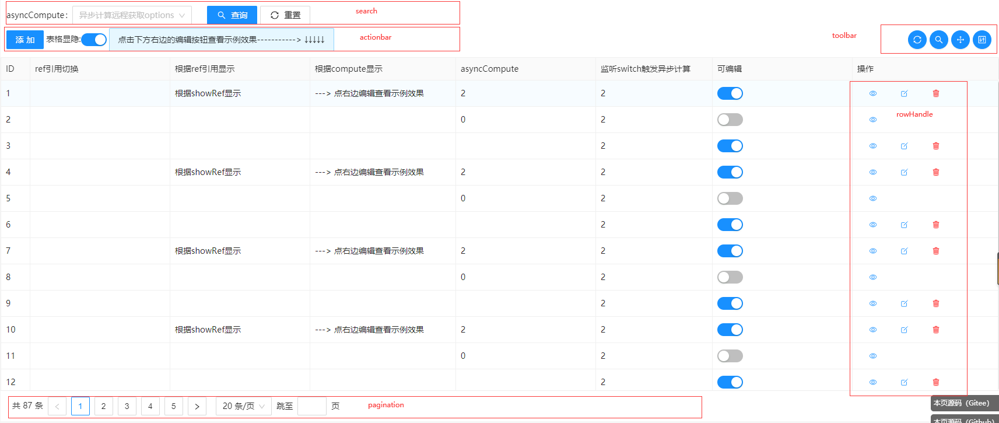
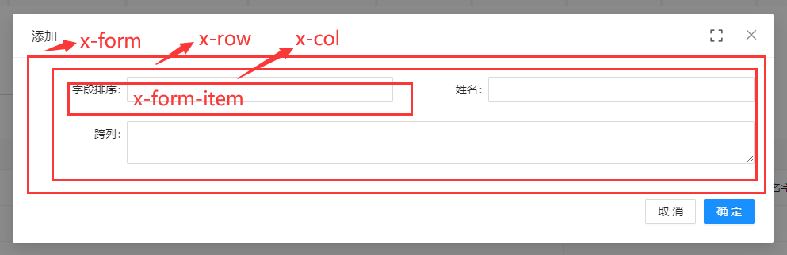

# API
详细配置文档。

## 阅读向导

API 参数来自三个层级。遇到参数未在当前页面逐项列出时，请按以下顺序查找：

1. **fast-crud 配置参数**：先查看下面的 `crudOptions.*` 页面，了解框架行为、默认值和回调上下文。
2. **fast-crud 封装组件参数**：再查看对应的 `fs-*` 组件页面，了解封装层新增的 props、事件和插槽。
3. **底层 UI 组件参数**：最后查看项目实际使用的 UI 框架官方文档。`el-*`、`a-*`、`n-*` 参数不能跨 UI 框架直接混用。

### 先认识页面区域

下面这张图展示了一个 CRUD 页面由哪些区域组成，以及这些区域由哪一项配置控制。第一次使用时先看图；需要修改某个页面区域时，再从下面的说明进入相应 API。

- **列表数据区域**：`table` 控制数据表格；`columns` 控制每一列显示什么；`rowHandle` 控制每行右侧的查看、编辑、删除等操作按钮；`pagination` 控制底部分页。
- **查询区域**：`search` 控制列表上方的查询条件和查询、重置按钮。
- **新增与编辑区域**：`form` 是共用表单配置；`addForm`、`editForm`、`viewForm` 分别覆盖新增、编辑和查看时的差异。
- **页面按钮区域**：`actionbar` 是表格左上方的添加等主要操作；`toolbar` 是右上方的刷新、列设置、导出等工具按钮。
- **页面外层布局**：`container` 控制 CRUD 页面最外层的布局容器。

### 深入查看组件参数

上面的配置会由 fast-crud 封装为组件。需要了解某个组件的额外参数、插槽或事件时，可进入 [FsTable](/api/components/crud/crud/fs-table.md)、[FsSearch](/api/components/crud/search/index.md)、[FsForm](/api/components/crud/crud/fs-form.md)、[FsRowHandle](/api/components/crud/crud/fs-row-handle.md)、[FsToolbar](/api/components/crud/toolbar/index.md) 和 [FsActionbar](/api/components/crud/actionbar/index.md)。

需要查看底层 UI 组件原生参数时

fast-crud 会将一部分参数透传到当前 UI 框架。请按项目实际使用的 UI 框架查看对应官方文档：

- 表格：[Element Plus Table](https://element-plus.org/zh-CN/component/table.html)、[Ant Design Vue Table](https://www.antdv.com/components/table-cn)、[Naive UI DataTable](https://www.naiveui.com/zh-CN/os-theme/components/data-table)
- 表单：[Element Plus Form](https://element-plus.org/zh-CN/component/form.html)、[Ant Design Vue Form](https://www.antdv.com/components/form-cn)、[Naive UI Form](https://www.naiveui.com/zh-CN/os-theme/components/form)
- 按钮：[Element Plus Button](https://element-plus.org/zh-CN/component/button.html)、[Ant Design Vue Button](https://www.antdv.com/components/button-cn)、[Naive UI Button](https://www.naiveui.com/zh-CN/os-theme/components/button)
- 分页：[Element Plus Pagination](https://element-plus.org/zh-CN/component/pagination.html)、[Ant Design Vue Pagination](https://www.antdv.com/components/pagination-cn)、[Naive UI Pagination](https://www.naiveui.com/zh-CN/os-theme/components/pagination)

### 字段组件入口

字段配置中的 `component` 会根据字段类型映射到具体组件，常用入口如下：

- [fs-dict-select](/api/components/crud/extends/fs-dict-select.md)、[fs-dict-radio](/api/components/crud/extends/fs-dict-radio.md)、[fs-dict-checkbox](/api/components/crud/extends/fs-dict-checkbox.md)
- [fs-dict-cascader](/api/components/crud/extends/fs-dict-cascader.md)、[fs-table-select](/api/components/crud/extends/fs-table-select.md)
- [fs-date-format](/api/components/crud/extends/fs-date-format.md)、[fs-values-format](/api/components/crud/extends/fs-values-format.md)
- [fs-file-uploader](/api/components/extends/uploader/components/fs-file-uploader.md)、[fs-cropper-uploader](/api/components/extends/uploader/components/fs-cropper-uploader.md)
- [fs-editor-wang5](/api/components/extends/editor/components/fs-editor-wang5/index.md)、[fs-editor-code](/api/components/extends/editor/components/fs-editor-code/index.md)、[fs-json-editor](/api/components/extends/json/components/fs-json-editor.md)

### 推荐阅读顺序

1. 第一次使用：先看 [InstallOptions](./install-options.md)、[Use](./use.md) 和 [CrudOptions](./crud-options/)。
2. 配置页面：再看 [request](./crud-options/request.md)、[columns](./crud-options/columns.md)、[form](./crud-options/form.md)、[search](./crud-options/search.md) 和 [table](./crud-options/table.md)。
3. 需要调用实例方法时：查看 [crudExpose](./expose.md)；需要字段类型示例时：查看 [官方字段类型列表](./types.md)。
4. 需要确认完整类型时：查看导航栏中的 [d.ts](http://fast-crud.docmirror.cn/d.ts/modules.html)。

## CrudOptions 配置总览

`CrudOptions` 的配置结构、组件与配置关系图、表单布局图统一维护在 [CrudOptions 总览](./crud-options/) 页面。字段配置中的 `form`、`addForm`、`editForm`、`viewForm` 和 `search` 会围绕同一个字段分别作用于不同场景，建议先阅读该页面再进入具体配置项。

