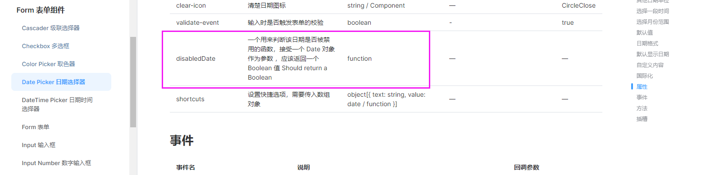

# 字段配置

## crudOptions.columns
在crudOptions中，最重要的是columns的配置
```js
const crudOptions ={
    columns:{
        key:{                              //字段的key
            title:'字段名',                 //字段名称
            type:'dict-select',            //字段类型
            dict: dict({url:'/dict/get'}), //字典配置（如果组件需要）
            column:{ component:{} },       //列配置
            form:{ component:{} },         //表单字段公共配置
            //以下是独立配置，会与上面的form配置合并。一般不需要配置
            addForm:{ component:{} },      //添加表单字段独立配置
            viewForm:{ component:{} },     //查看表单字段独立配置
            editForm:{ component:{} },     //编辑表单字段独立配置
            search:{ component:{} },       //查询表单字段独立配置
            valueBuilder(){},              //值构建，具体请参考api/crud-options/columns.html文档
            valueResolve(){}               //值解析
        }
    }
}
```

更多帮助请参考[字段配置api文档](/api/crud-options/columns.md)

## 字段类型
系统内置了一些字段类型，每个字段类型背后代表了一段字段配置    
[字段类型帮助说明](./column-type.md)


## valueChange
`valueChange` 可以监听数据变化，可以在`search`、`addForm`、`editForm`、`viewForm`、`column`中监听数据变化

```js
const crudOptions = {
    columns:{
        test:{
            search:{
                valueChange(context){
                    // 监听查询框此字段的数据变化
                    console.log(context)
                }
            },
            form:{
                valueChange(context){
                    // 监听添加表单、编辑表单、查看表单此字段的数据变化
                }
            },
            column:{
                valueChange(context){
                    // 监听table单元格中的数据变化
                }
            }
        }
    }
}

```


## 字段组件配置
字段组件分为两种：
* 一种展示组件，出现在表格单元格中。
* 另外一种是form输入组件，出现在查询框、添加表单、修改表单、查看表单中。

对应到具体的配置中：
 1. columns.key.form.component = 表单组件配置
 2. columns.key.column.component = 表格行展示组件配置
 3. columns.key.search.component = 查询表单组件配置
 4. columns.key.viewForm.component = 查看表单组件独立配置
 5. columns.key.addForm.component = 添加表单组件独立配置
 6. columns.key.editForm.component = 编辑表单组件配置

::: warning
使用相关组件前，需要通过`app.use` 、 `app.component`全局引入组件    
或者在`component.name`直接引用组件
:::
## 组件配置项

[组件配置项文档](../../api/common-options.md#component-name)    

以`fs-dcit-select`为例 
```js
const crudOptions = {
    columns:{
        form:{
            component:  { //组件配置
                name: 'fs-dict-select', //表单组件名称，支持任何v-model组件
                //name: SubTable,局部引用组件，见嵌套表格示例

                //v-model绑定属性名，element一般为'modelValue'（可以不传）
                //antdv一般为'value'，必须要传
                //也可以是其他支持v-model属性名，比如a-checkbox的checked属性
                vModel: 'modelValue',

                disabled: false, //组件是否禁用
                readonly: false, //组件是否是只读
                show: true, //是否显示该组件
                on:{ //组件事件监听
                    onClick(context){console.log(context)} //监听组件的事件
                },
                slots:{ //组件的插槽(仅支持jsx)
                    default:(scope)=>{  //默认插槽
                        return (<div>{scope.data}</div>)
                    },
                    slotName:(scope)=>{  //具名插槽
                        return (<div>{scope.data}</div>)
                    }
                },

                // html属性,会直接传递给dom
                style:{width:'100px'},
                class:{'mr-5':true},

                //还可以在此处配置组件的参数，具体参数请查看对应的组件文档，不同组件参数不同
                separator:",",        //这是fs-dict-select的参数

                //fs-dict-select内部封装了el-select组件，所以此处还可以配置el-select的参数
                //如果ui用的是antdv，则支持a-select的参数
                filterable: true,     //可过滤选择项,
                multiple: true,       //支持多选
                clearable: true,      //可清除

                //如果组件的参数与上面的参数有冲突，则需要配置在props下。
                props:{
                    //比如name、vModel、props、on、children等等
                    //如果你要用的组件里面需要配置以上这些名字的参数的话，可以配置在此处
                }

            }
        }
    }
}

```

## 我想要配置组件的某个功能该如何查找文档
下面以`日期选择器禁用今天之前的日期`这个需求为例
### 1. 查看type对应使用的什么组件
日期选择器我们配置的 `type=date`    
所以先去[字段类型列表](../../api/types)，查找`type=date`里面用的是什么组件   
在[日期时间选择](../../api/types#日期时间选择)这一条中我们找到了`type=date`的配置
```js
const types ={
    date: { // <----字段类型名
        form: { component: { name: 'el-date-picker' } },
        column: { component: { name: 'date-format', format: 'YYYY-MM-DD' } }
    }
}
```
从这里知道`type=date`使用的`el-date-picker`组件

### 2.查找该组件的文档，确定参数
在[日期时间选择](../../api/types#日期时间选择), 可以看到它使用的是什么组件。

这里它使用了这个`el-date-picker`组件，找到它的文档，然后找到禁用日期相关参数



### 3.给component添加参数
```js
export default ({expose}) => {
    return {
        crudOptions:{
            columns: {
                createDate:{
                    title: '日期',
                    type:'date',
                    form:{
                        component:{
                            disabledDate: time => {  // <----禁用日期的配置
                                return time.getTime() < Date.now()
                            },
                            // slots:{
                            //     //您还可以通过slots配置组件插槽
                            //     default({form,row,value,key,scope}){
                            //         return <div>这是一个插槽:{value}</div>
                            //     }
                            // }
                        }
                    }
                }
            }
        }
    }
}
```
