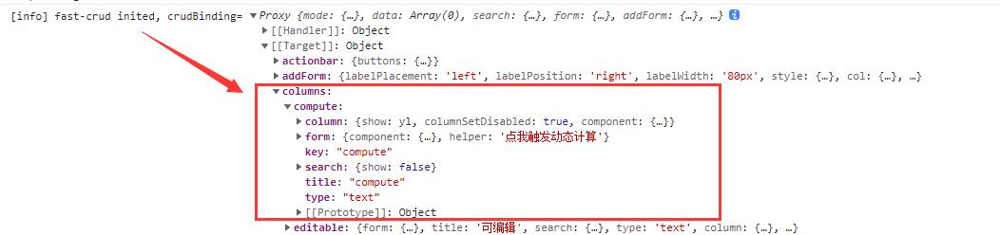

# 动态计算
:::tip

 本章节也非常重要，请务必仔细阅读   

:::

动态计算主要用于解决配置需要动态变化的问题. 是fs-crud最重要的特性之一   

配置动态变化可以有如下4种方式实现：    
1. 直接修改`crudBinding`对应的属性值。比如`crudBinding.value.search.show=false`即可隐藏查询框。
2. 给属性配置`ref、computed`类型的值，通过修改`ref.value`，就能够动态变化。
3. `compute` 同步计算，类似`computed`，不同的是它可以根据上下文进行动态计算。
4. `asyncCompute`异步计算，基于`watch 和 computed`实现,与`compute`相比,它支持异步计算。 

## 1. 直接修改crudBinding

直接修改crudBinding内的值是最简单粗暴的动态方式，它需要对crudBinding结构有一些了解。      
你可以从以下途径了解crudBinding数据结构：
1. [crudBinding数据结构文档](/d.ts/types/CrudBinding.html)
2. 通过`fast-crud`初始化日志查看 
   

```js
// 使用示例
// 可以动态隐藏查询框
crudBinding.value.search.show=false
```


## 2. ref和computed【ref引用】
给`crudOptions`里的属性配置`ref或者computed`即可实现全局动态变化。     
你只需保存`ref`的引用，然后通过修改`ref.value`，达到动态修改的目的。    
```js
//默认ref不显示table
const showTableRef = ref(false)
//或者使用computed计算出是否显示table
const showTableComputed = computed(()=>{
    return showTableRef.value
})
const crudOptions = {
    table:{
        show:showTableRef //换成showTableComputed是一样的效果
    }
}

// 当修改showTableRef.value=true，可实现table的动态显隐
showTableRef.value = true

```

::: warning   
您必须使用 `const {cloneDeep,merge} = useMerge()`来对`crudOptions`进行`merge`和`cloneDeep`操作  
否则会破坏`ref`的响应性   
:::

## 3. compute 【同步计算】
> 注意后面没有`d`，基于`vue`的`computed`，用法类似，不同的是它支持上下文参数      
> 开发过程中但凡遇到需要根据表单数据或者行数据参与动态计算的，用`compute`或者`asyncCompute`就对了
> `compute`代价比`computed`更高，能用computed的就不要用compute


* 方法：compute(Function(context))
* context： [上下文](#context【上下文】)，一般包含`row`/`form`/`index`/`getComponentRef`
* return: 返回计算后的配置值


示例1：      
可应用于某个组件需要多个输入参数的场景       
比如：每一条记录是一种设备，不同的设备温度的上限和下限不一样，我们一个滑动输入组件，用来显示设备温度。

```js
const records = [
    {name:"内部水温",temp:"50",max:100,min:0},
    {name:"外壳温度",temp:"300",max:1000,min:-10},
]
```
```js

import { useCompute } from "@fast-crud/fast-crud";
const {compute} = useCompute()
const crudOptions={
    columns:{
        temp:{
            title:"温度",
            column:{
                name:"a-slider",
                // 此处温度的上限和下限由每一行的max和min字段决定
                max: compute(({row})=>{
                    return row.max
                }),
                min: compute(({row})=>{
                    return row.min
                })
            }
        },
    }
}
```

示例2：   
很常见的需求：        
一个用户表，有个用户类型字段`userType`,可能的值为：`公司`或`个人`。     
我们要实现，当选择`公司`时，需要额外`上传营业执照`、`填写信用代码`的功能。    
就需要在`userType`字段选中`公司`的时候，将`上传营业执照`和`信用代码`的输入框显示出来。选择`个人`时则不显示。

```js
import {useCompute} from '@fast-crud/fast-crud'
const {compute} = useCompute()
const crudOptions = {
    columns:{
        userType:{
            title: '用户类型',
            type: 'dict-select',
            dict: dict({data:[
                    {value:1,label:'个人'},
                    {value:2,label:'公司'}
                ]})
        },
        businessLicenceImg :{
            title: '营业执照上传',
            type: 'avatar-uploader',
            form:{
                show:compute((context)=>{
                    // 通过动态计算show属性的值，当前表单内的userType值为公司，才显示此字段
                    return context.form.userType ===2
                })
            }
        },
        businessLicenceCode :{
            title: '营业执照号码',
            type: 'text',
            form:{
                show:compute((context)=>{
                    // 通过动态计算show属性的值，当前表单内的userType值为公司，才显示此字段
                    return context.form.userType ===2
                })
            }
        }
    }
}

```

用户类型（userType）是一个下拉选择框，当用户选择不同的值时会改变`form.userType`的值，同时会触发`businessLicenceImg`和`businessLicenceCode`这两个字段中`form.show`的重新计算。
从而让`营业执照上传`和`营业执照号码`根据`userType`的值不同而显隐。

## 4. asyncCompute 【异步计算】
当我们要计算的值需要从网络请求或者从其他地方异步获取时可以使用此方法配置

* 方法：asyncCompute({watch?,asyncFn})
* 参数`watch`：Function(context) ,可为空，监听一个值，当这个返回值有变化时，触发asyncFn。不传则asyncFn只会触发一次
* 参数`asyncFn`：asyncFn:Function(watchValue`watch的返回值`,context) ,异步获取值

例如：年级班级选择联动
```js
import {compute} from '@fast-crud/fast-crud'
const crudOptions = {
    columns:{
        grade:{
            title: '年级',
            type: 'text',
            form: {
                component:{
                    name:'a-select',
                    //配置异步获取选择框的options
                    options: asyncCompute({
                        //没有配置watch，只会触发一次
                        asyncFn: async ()=>{
                            //异步获取年级列表，这里返回的值将会赋给a-select的options
                            return request({url:"/getGradeList"})
                        }
                    })
                }
            }
        },
        class :{
            title: '班级',
            type: 'avatar-uploader',
            form:{
                component:{
                    name:'a-select',
                    //配置异步获取选择框的options
                    options: asyncCompute({
                        //监听form.grade的值
                        watch((context)=>{
                            return context.form.grade
                        }),
                        //当watch的值有变化时，触发asyncFn,获取班级列表
                        asyncFn: async (watchValue,context)=>{
                            //这里返回的值 将会赋值给a-select的options
                            return request({"/getClassList?grade=" + watchValue})
                        }
                    })
                }
            }
        },
    }
}

```

::: warning   
`asyncCompute`本身不支持动态，您不能在useFsAsync中使用它   
:::   

## context【上下文】
在如下三个位置会具有上下文。(对应字段下的几个配置)
* `表格的每一行所有列`是一个上下文范围
* `表单里的所有字段`是一个上下文范围（表单里又分为addForm、editForm、viewForm）
* `搜索框的所有字段`是一个上下文范围
`context`里面的内容根据所处的位置不同，包含的内容不同,比如在表格行的上下文里面就没有form,具体有什么你可以在实际使用过程中log出来看看
```js
context = {
    row:Object, 
    form:Object, //表格行的context里没有
    index:number, //addForm和search的context里没有
    getComponentRef:(columnKey)=>vm //获取上下文范围内的组件ref实例方法
}
```

## 适用范围
1. 对于`ref或computed`类型的动态，基本上整个`crudBinding`都支持
2. 对于`compute或asyncCompute`,则仅在`columns.key.form`（`form.wrapper`下仅`buttons`支持）、`columns.key.xxxForm`、`columns.key.column`（show等跟行数据无关的属性不支持）、`columns.key.search`、`rowHandle`下的属性支持
3. `form.value`不支持`asyncCompute`/`Compute`方式动态，此方式需要先有上下文，上下文包含form，而form.value需要先计算出默认值；建议在wrapper.onOpened方法中直接设置表单默认值。

总之，只有在需要用到`行数据(row)、表单数据(form)`参与动态计算的地方，才使用`compute`和`asyncCompute`。其他时候使用`ref`或`computed`

::: warning  
使用动态计算会失去配置合并特性，无法与公共配置和基础配置进行合并。     
建议只在末端配置上使用动态计算
:::


## 动态计算demo地址
[antdv版](http://fast-crud.docmirror.cn/antdv/#/crud/basis/compute)  |
[element版](http://fast-crud.docmirror.cn/element/#/crud/basis/compute) |
[naiveui版](http://fast-crud.docmirror.cn/naive/#/crud/basis/compute)
