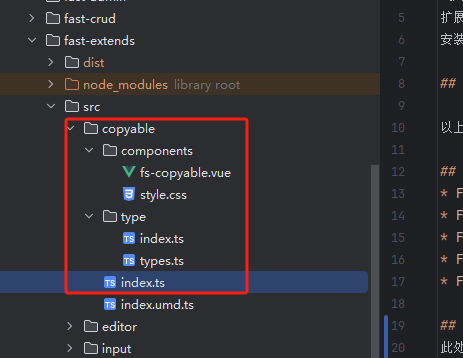
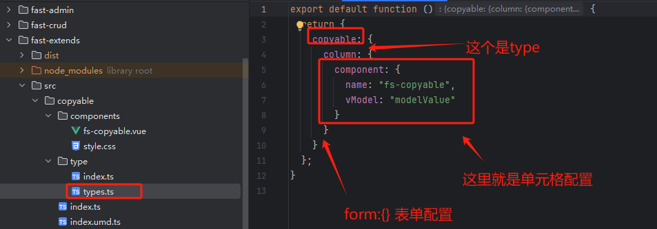

# extends【扩展】
"扩展包"是指将一组或多组单元格显示组件、表单输入组件、字段类型打包成一个扩展包。      
扩展包可以发布到npm，供其他用户使用。     
安装好扩展包之后，你只需要给字段配置字段类型即可使用扩展包里的组件。 

## 扩展包使用方法

以上传组件为例： 请查阅[fast-extends/uploader](../extends/uploader.md) 上传扩展文档

## 官方扩展包
* FsExtendsUploader: 上传扩展 [fast-extends/uploader](../extends/uploader.md)
* FsExtendsEditor: 富文本编辑器 
* FsExtendsJson: Json编辑器
* FsExtendsCopyable: 文本复制到剪贴板
* FsExtendsTime: 时间格式人性化组件

## 自定义扩展包
此处以`fast-extends`中的`copyable`扩展为例

1. 复制copyable结构到项目中
components目录里面是自定义组件，type目录里面是字段类型



2. 编写自定义组件   
[自定义组件编写规范](/guide/advance/custom-component.md)

3. 编写字段类型配置
   

4. 导出配置

```js
//此处为字段类型配置
import FsExtendsType from "./type";
import { utils } from "@fast-crud/fast-crud";
// @ts-ignore 这里异步加载组件，可以让组件懒加载，不会影响首页打包体积
const asyncModules = import.meta.glob("./components/*.vue");
// 依赖的第三方组件，应尽量在components/*.vue中局部加载，可以减少打包提及
// 此处VueClipboard由于他是一个directive，需要全局加载，不好做局部加载
import { VueClipboard } from "@soerenmartius/vue3-clipboard";
const FsExtendsComponents = {
  install(app: any) {
    //加载异步组件，异步组件将会被懒加载，所以不用担心打包之后的体积问题
    utils.vite.installAsyncComponents(app, asyncModules, [], null, null);
  }
};
// 导出扩展包， 在项目中 app.use(FsExtendsCopyable) 即可
export const FsExtendsCopyable = {
  install(app: any) {
    app.use(FsExtendsType);
    app.use(FsExtendsComponents);
    app.use(VueClipboard);
  }
};

```