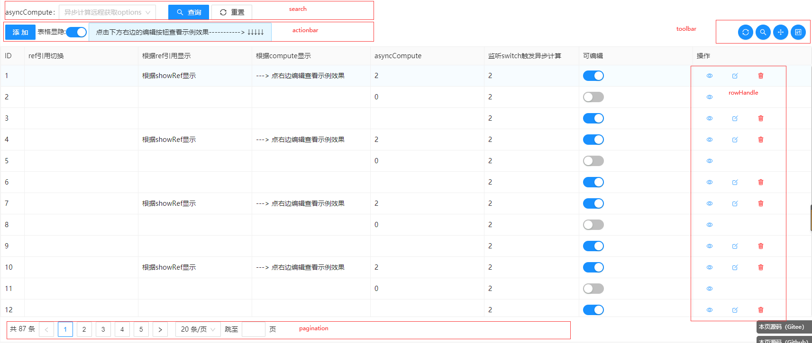

# CrudOptions


## 总览
页面crud配置概览
```js
const crudOptions ={
    request:{},     //http请求
    columns:{       //字段配置
        key:{       //字段key
            column:{},  //对应table-column配置
            form:{},    //表单中该字段的公共配置，viewForm、addForm、editForm、search会集成此配置，支持对应ui的form-item配置
            viewForm:{}, //查看表单中该字段的配置，支持对应ui的form-item配置
            addForm:{}, // 添加表单中该字段的配置，支持对应ui的form-item配置
            editForm:{}, //编辑表单中该字段的配置，支持对应ui的form-item配置
            search:{}   //对应查询表单的form-item配置
        }
    },     
    search:{        //查询框配置 ，对应fs-search组件
        options:{}  //查询表单配置 ，对应el-from, a-form配置    
    },     
    actionbar:{},   //动作条，添加按钮，对应fs-actionbar组件
    toolbar:{},     //工具条 ，对应fs-toolbar组件
    table:{         //表格配置，对应fs-table
                    // 对应 el-table / a-table的配置
        slots:{}    // 对应el-table ,a-table的插槽
    },
    data:{},        //列表数据，无需配置，自动从pageRequest中获取 
    rowHandle:{},   //操作列配置，对应fs-row-handle
    form:{          //表单的公共配置,对应el-form，a-form配置
        wrapper:{}  //表单外部容器的配置，对应el-dialog,el-drawer,a-model,a-drawer的配置
    },       
    viewForm:{},    //查看表单的独立配置
    editForm:{},    //编辑表单的独立配置
    addForm:{},     //添加表单的独立配置
    pagination:{},  //分页配置 ，对应el-pagination / a-pagination
    container:{},   //容器配置 ，对应fs-container
}

```

## 页面布局



##  配置API
更多详细配置请[参考API](../../api/index.md)
