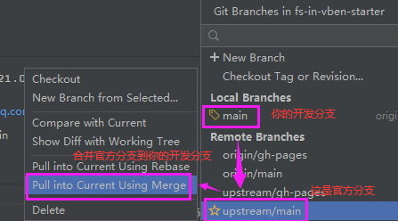

# 版本升级

## 依赖版本升级
如果你只想升级fast-crud，则只需要升级依赖版本即可，可以选择如下两种方式：

### 1.手动升级 【推荐】

修改`package.json`的`dependencies`如下依赖包的版本号     
  
* @fast-crud/fast-crud:xxx
* @fast-crud/fast-extends:xxx
* @fast-crud/ui-xxx:xxx
     
将以上依赖版本号全部改成最新的   
然后执行`npm install` 或 `yarn install` 即可

> 最新的版本号请查看 [changelog](./changelogs/CHANGELOG.md)

### 2.命令行升级
项目根目录下执行如下命令即可升级`fast-crud`到最新版本
```
#使用npm
npm update

#或使用yarn 
yarn upgrade

#或手动选择升级版本
yarn upgrade-interactive --latest
```

### 其他命令参考
```shell script
yarn upgrade //升级依赖小版本
yarn outdated //查看依赖是否有新版本升级
yarn upgrade-interactive --latest //手动选择升级依赖

pnpm outdated // 检查依赖版本是否有升级
pnpm up --latest //升级依赖版本,不加lastest则仅在小版本范围内升级

pnpm update --interactive --latest //选择性的更新依赖
```


## fs-admin或者starter升级
如果你是使用的fs-admin-xxx或者fs-in-xxx-starter 的工程作为基础开发的，且想要同步fs-admin等脚手架的功能，请按如下步骤进行升级：


下面以fs-in-vben-starter为例
### 一、准备工作
分三种情况，请根据你的现状做对应的准备：

#### 现状1、 你的项目还未开始，并且准备在gitee或者github上进行管理，那么准备工作很简单。
1. 直接`fork` `fs-in-vben-starter` 到你的账户 
2. 然后`clone` 新仓库地址到你本地


#### 现状2、 你的项目还未开始，并且准备在自建git服务器上进行管理。请按如下步骤操作：

1. clone示例仓库 
```shell
git clone https://github.com/fast-crud/fs-in-vben-starter
```

  2. 修改远程仓库地址
修改 `${clone下来的仓库目录}/.git/config` 文件
```shell
[remote "origin"]
url = https://github.com/fast-crud/fs-in-vben-starter.git
######↑↑↑↑↑↑↑↑↑↑↑↑↑↑↑↑↑↑ 这里改成你自己的项目地址↑↑↑↑↑↑↑↑↑↑↑↑↑↑
fetch = +refs/heads/*:refs/remotes/origin/*
```

3. push代码到你的新仓库地址
```shell
git push
```

#### 现状3、如果你的项目已经在旧官方项目的基础上进行过一段时间了，并且没有做上面的准备工作，请按如下步骤操作：
1. 团队所有成员提交并push代码
2. 先clone官方仓库到一个新目录，找到你建项目时的官方当时版本的log记录，通过这个记录建一个分支，checkout这个分支
3. 用你现有的项目文件，全面覆盖这个分支，然后提交一次。再合并到main分支上。
4. 修改远程仓库地址为你的项目地址，修改`%新项目的目录%/.git/config`文件
```shell
[remote "origin"]
url = https://github.com/fast-crud/fast-crud.git
// ------------------↑↑↑↑↑↑↑↑ 修改成你旧项目git地址

```
5. 执行强制push
```shell
git push --force
```
6. 团队所有人删掉原来的项目，重新用旧项目地址clone即可

### 二、进行你自己的开发任务
经过上面的准备工作之后，你就可以在这个基础上进行你的开发任务了。

### 三、 官方发布了新的更新，你想升级了
请按如下进行与官方同步更新操作:
1.  添加官方分支作为上游（此步骤只需做一次）
```shell
git remote add upstream https://github.com/fast-crud/fs-in-vben-starter.git
```
2.  同步官方进度到本地
```shell
git fetch upstream
```
3.  合并到你自己的开发分支上
```shell
git merge upstream/main
# 这一步建议在idea、webstorm、vscode或者其他git管理工具上进行操作，因为涉及到解决冲突部分     
# idea、webstorm 请参考下图进行操作
```



4. 解决冲突，然后提交、push即可


::: tip
以上是手动同步，推荐使用同步神器自动同步： [trident-sync](https://github.com/handsfree-work/trident-sync)
:::
