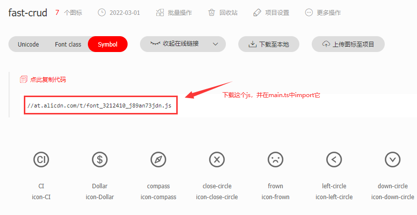

# 图标

## FsIcon

1. `fast-crud`底层使用`FsIcon`组件来使用图标，通过`icon`属性来配置图标
2. 当`icon`参数以`svg:`开头时会被识别为icon-svg图标（例如：`icon="svg:check"`）
3. 当`icon`参数包含`:`时会被识别为iconify图标（例如：`icon="ion:apps-sharp"`）
4. 否则视为ui库的内置图标(例如`icon="CheckOutlined"`)
5. 使用ui库的内置图标需要事先全局注册该图标。

## 一、使用内置图标
### 1.注册图标组件
```js
import { CheckOutlined } from "@ant-design/icons-vue"; 
app.component("CheckOutlined",CheckOutlined)
```
### 2.使用内置图标
```html
<fs-icon icon="CheckOutlined"/>
```


## 二、使用`iconify`图标

示例项目中使用了`iconify`图标 

::: tip
`1.20.0`版本之后，`iconify`图标已经内置到`fast-crud`中，无需额外配置，直接按照步骤4使用即可     
不支持离线打包进安装包，如果你要在无网络环境下使用（主要是用户浏览器无网络，服务器没有网络没关系），请参考[本地部署Iconify接口](https://blog.csdn.net/honor_zhang/article/details/135192448)
::: 


<details> 
    <summary>过时的内容，已折叠</summary>

~~如果你想集成到你的项目中，请按如下步骤配置~~
###  ~~1. 安装依赖~~

```json
 {
  "devDependencies": {
    "vite-plugin-purge-icons": "^0.7.0",
    "@iconify/iconify": "^2.0.1",
    "@iconify/json": "^1.1.376",
    "@purge-icons/generated": "^0.7.0"
  }
}

```

### ~~2. 配置vite插件~~
```js
// vite.config.js
return {
    plugins: [
        vue(),
        PurgeIcons(), //主要配置它
    ]
}
```

### ~~3. `main.ts` 中导入`generated`~~
```js
import "@purge-icons/generated";
```


</details>


### 4. fs中配置使用`iconify`图标

1. 从[iconify图标库](https://icon-sets.iconify.design/) 中查找你要使用的图标，复制图标名称，配置到`icon`属性上即可.
2. 注意图标名称要是`xxx:yyyy`格式的，中间要有冒号，例如：`ion:add-circle`。
3. 如果图标没有冒号的，请确认当前图标所在图标库名，图标库名后面的第一个`-`换成`:`即可

   
### 5. 独立使用`iconify`图标
```html
 <fs-icon :icon='iconFamily:iconName'/>
```


## 三、使用阿里巴巴`iconfont svg` 图标

### 1. 创建图标js，并引入项目中
1. 前往iconfont注册账号： https://www.iconfont.cn/
2. 选择图标放到购物车，并将图标添加到项目
3. 选择Symbol方式导出
4. 下载js，放到项目中，并在main.ts中import它
5. 或者直接在`index.html`中引入`<script  src="//at.alicdn.com/t/font_xxxxxxxx.js"/>`



### 2. 使用svg图标
点击上图中的图标按钮会复制出图标名称`icon-xxxxx`，将`icon-`替换成`svg:`传入`icon`参数即可
```html
 <fs-icon :icon='svg:compress'/>
```
